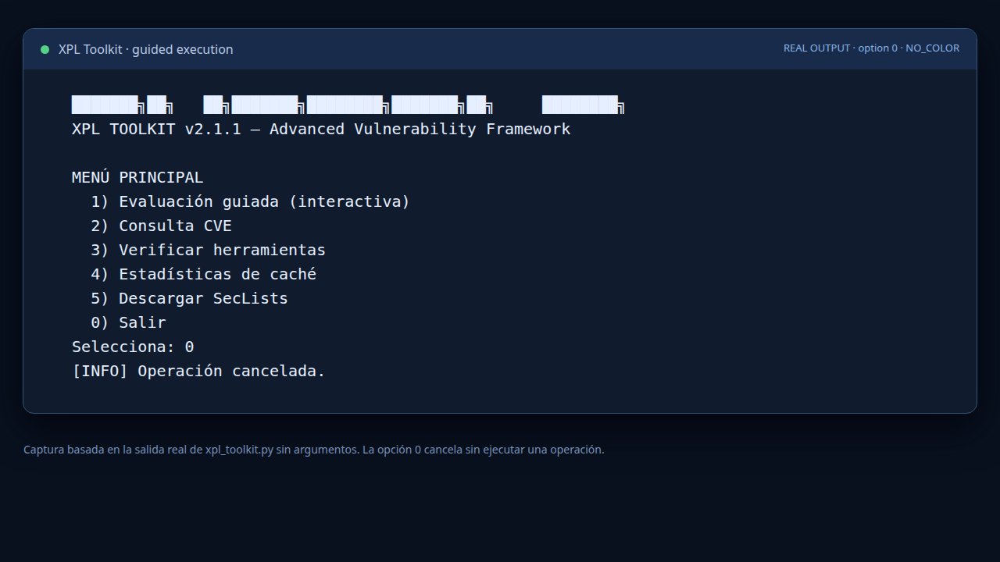

# XPL Toolkit

XPL Toolkit es una herramienta de línea de comandos para reconocimiento y verificación de seguridad sobre activos autorizados. El punto de entrada principal es `xpl_toolkit.py`, que reúne el flujo interactivo, el modo batch, las consultas CVE con NVD, los reportes y las funciones opcionales de verificación.



*Captura de documentación basada en salida local verificada; no contiene objetivos ni credenciales reales.*

> **Uso responsable:** ejecuta la herramienta sólo sobre sistemas propios, laboratorios o activos cubiertos por autorización explícita. El modo batch `verify` es la opción predeterminada para validación; cualquier prueba activa, explotación, fuerza bruta o post-explotación requiere autorización independiente y documentada.

## Capacidades

| Capacidad | Descripción |
| --- | --- |
| Flujo interactivo | Solicita objetivo, servicio, autorización y etapas de reconocimiento, verificación y reporte. |
| Modo batch | Permite ejecución no interactiva con `--batch-auth verify`, `full` o `cancel`. |
| Consulta CVE | Consulta NVD, aplica filtros de severidad y puede exportar tabla, JSON o CSV. |
| Caché local | Conserva resultados de CVE en una caché SQLite local para reducir consultas repetidas. |
| Reportes | Genera reportes HTML y Markdown con valores externos escapados. |
| Verificación de herramientas | Detecta dependencias externas y ofrece instalarlas sólo después de confirmación interactiva. |
| Sesiones | Guarda cronología y artefactos de sesión fuera del repositorio, en `/home/ubuntu/sessions`. |

El repositorio conserva `xpl_toolkit_v2.py` como compatibilidad temporal para instalaciones existentes. El script principal y recomendado es `xpl_toolkit.py`; no se crea un segundo punto de entrada nuevo.

## Requisitos

Se requiere Python 3.11 o posterior. Las herramientas externas son opcionales y dependen del flujo elegido: `nmap`, `httpx`, `subfinder`, `gobuster`, `searchsploit`, `hydra`, `sqlmap`, `cewl`, `gcc`, `smbclient`, `enum4linux`, `dig`, `curl` y, en casos concretos, `msfconsole`.

La clave de NVD, si se dispone de ella, debe configurarse mediante una variable de entorno y nunca debe escribirse en el código:

```bash
export NVD_API_KEY="tu-clave-nvd"
```

El repositorio no declara una licencia explícita. No debe describirse como software open source hasta que el propietario añada una licencia.

## Inicio seguro

Consulta la ayuda del script principal y las estadísticas de caché antes de realizar una evaluación:

```bash
python3 xpl_toolkit.py --help
python3 xpl_toolkit.py --cache-stats
```

El modo de verificación de herramientas puede modificar el sistema mediante `apt-get` o `go install` después de una confirmación. Para inspeccionar sin instalar, usa entrada cerrada o ejecuta el chequeo desde un entorno que no permita confirmación:

```bash
python3 xpl_toolkit.py --check-tools < /dev/null
```

Si ejecutas `python3 xpl_toolkit.py` sin argumentos, aparece un menú guiado conciso:

| Opción | Acción |
| --- | --- |
| `1` | Evaluación guiada interactiva; reutiliza el flujo existente de objetivo, servicio y autorización. |
| `2` | Consulta CVE con consulta y severidad mínima opcional. |
| `3` | Verificación de herramientas; la instalación requiere confirmación. |
| `4` | Estadísticas de caché local. |
| `5` | Descarga de SecLists. |
| `0` | Cancelar y salir sin ejecutar una operación. |

El menú sólo reacomoda el acceso a funciones ya existentes. Los argumentos CLI directos, el modo batch y los formatos de salida se conservan.

## Uso autorizado

Para iniciar el flujo interactivo:

```bash
python3 xpl_toolkit.py 192.0.2.10 smb
python3 xpl_toolkit.py example.com web-recon
```

`192.0.2.10` es una dirección reservada para documentación y no concede autorización para escanear ningún sistema real.

Para una ejecución no interactiva con verificación solamente:

```bash
python3 xpl_toolkit.py --batch example.com web-recon --batch-auth verify
```

El modo de explotación completa sólo puede utilizarse cuando la autorización cubre expresamente esa actividad:

```bash
python3 xpl_toolkit.py --batch AUTHORIZED_TARGET SERVICE --batch-auth full
```

Otros modos disponibles:

```bash
python3 xpl_toolkit.py --cve-only "apache httpd 2.4" --min-severity HIGH
python3 xpl_toolkit.py --cve-only "log4j" --output json --out cves.json
python3 xpl_toolkit.py --download-seclists
python3 xpl_toolkit.py --cache-stats
```

El módulo Bash conserva su uso separado:

```bash
bash exploitdb_30.sh <target> <output_dir>
```

Ese módulo ejecuta consultas `searchsploit` y debe utilizarse únicamente en un entorno autorizado.

## Flujo operativo

El flujo típico crea una sesión, detecta servicios, realiza reconocimiento específico, consulta CVE, solicita autorización antes de acciones intrusivas, ejecuta verificaciones permitidas y genera reportes. Las funciones pueden transmitir tráfico al objetivo, consultar NVD, descargar listas de palabras, ejecutar herramientas locales o iniciar módulos externos según el modo escogido.

Los resultados de reconocimiento, CVE, credenciales encontradas, topología, versiones y salidas de herramientas son información sensible. Conserva las sesiones fuera del repositorio, limita sus permisos y elimina tokens, nombres internos y objetivos fuera de alcance antes de compartir un reporte.

## Estructura actual

| Archivo | Propósito |
| --- | --- |
| `xpl_toolkit.py` | Punto de entrada principal consolidado. |
| `xpl_toolkit_v2.py` | Compatibilidad temporal para invocaciones existentes. |
| `exploitdb_30.sh` | Consultas agrupadas a ExploitDB. |
| `XPL Toolkit.md` | Descripción ampliada del flujo y capacidades. |
| `tests/test_toolkits.py` | Pruebas unitarias sin red ni herramientas externas. |
| `docs/tutorial.md` | Tutorial reproducible y límites operativos. |
| `docs/structure-suggestions.md` | Sugerencias de reorganización futura sin cambios aplicados. |

## Pruebas

Ejecuta las pruebas desde la raíz del repositorio:

```bash
python3 -m unittest discover -s tests -v
python3 -m py_compile xpl_toolkit.py xpl_toolkit_v2.py tests/test_toolkits.py
bash -n exploitdb_30.sh
python3 xpl_toolkit.py --check-tools < /dev/null
```

Las pruebas unitarias no hacen conexiones de red ni lanzan herramientas externas. Los artefactos locales como caché, logs, sesiones y wordlists permanecen excluidos mediante `.gitignore`.

## Seguridad y divulgación

Consulta [`SECURITY.md`](SECURITY.md) para reportar problemas del proyecto. No publiques credenciales, API keys, informes de evaluación, resultados de explotación ni datos de objetivos en issues o materiales promocionales.
